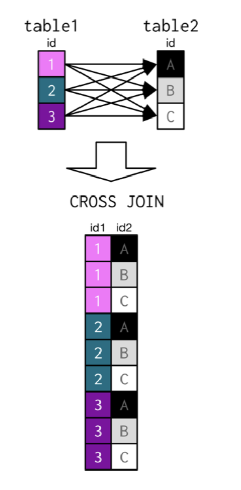
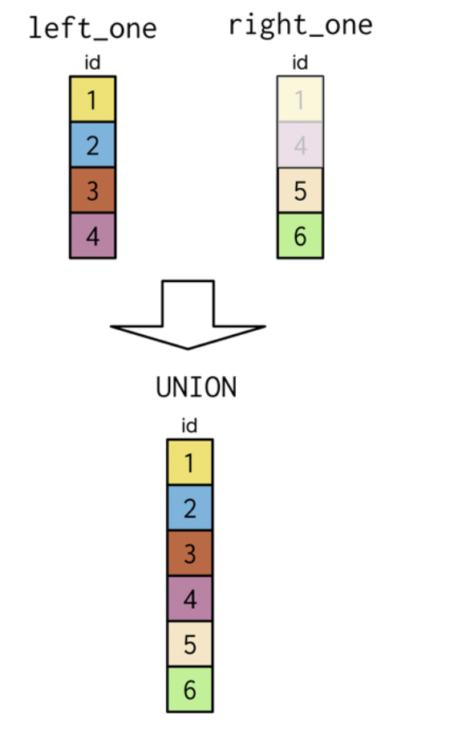

```{r setup, include=FALSE}
knitr::opts_chunk$set(echo = TRUE)
```

## Introduction
### Common protocals  

* Always add a semi-colon after each query.
* [Holywell's SQL style guide](https://www.sqlstyle.guide)

### SELECTing columns

* `SELECT DISTINCT language FROM films;` is useful to check how many distinct languages are represented in the database. 

* `SELECT COUNT(*) FROM people;` lets you count the number of entities in the database. However, if you want to count the number of **non-missing** values in a particular column, you can call `COUNT()` on just that column. `SELECT COUNT(birthdate) FROM people;`. **If you do `COUNT() WHERE IS NULL` you will get 0.**

* `SELECT COUNT(DISTINCT birthdate) FROM people;` lets you count the distinct birthdates. **Note that SQL does not use UNIQUE.**

* Subqueries in SELECT statements generate a single value that allow you to pass an aggregate value down a data frame. 

```{sql subqueries_in_select, eval=FALSE}
SELECT 
	name AS league,
    -- Select and round the league's total goals
    round(avg(m.home_goal + m.away_goal), 2) AS avg_goals,
    -- Select & round the average total goals across all leagues for the season
    (SELECT round(avg(home_goal + away_goal), 2) 
     FROM match
     where season = '2013/2014') AS overall_avg
FROM league 
WHERE season = '2013/2014'
GROUP BY league;
```

### Filtering results

* Joining multiple filters: 

```{sql WHERE_filter,eval=FALSE}
SELECT title FROM films
WHERE (release_year = 1994 OR release_year = 1995)
AND (certification = 'PG' OR certification = 'R');
```

* Filtering by range:

```{sql WHERE_filter_range,eval=FALSE}
SELECT title
FROM films
WHERE release_year BETWEEN 1994 AND 2000;
AND age IN (2, 4, 6, 8, 10)
```

* `NULL` represents missing or unknown values. Example of usage: `SELECT COUNT(*) FROM database WHERE abc IS NULL` or `SELECT FROM WHERE IS NOT NULL`.

* `LIKE` and `NOT LIKE` let  you search for a pattern in a column. There are 2 wildcards you can use:
    * The` % `wildcard will match zero, one, or many characters in text. For example, the following query matches companies like 'Data', 'DataC' 'DataCamp', 'DataMind', and so on: `SELECT FROM WHERE xxx LIKE Data%`
    
    * The `_` wildcard will match a single character. For example, the following query matches companies like 'DataCamp', 'DataComp', and so on: `SELECT FROM WHERE xxx LIKE DataC_mp`.
    
    * You can also use the ` NOT LIKE` operator to find records that don't match the pattern you specify.
    
### Aggregate functions

```{sql aggregate,eval=FALSE}
SELECT MAX(budget) AS max_budget,
MAX(duration) AS max_duration
FROM films;`
```


    
### Sort and group

* `ORDER BY` keyword is used to sort results according to the values of one or more columns. By default `ORDER BY` will sort in *ascending order*. If you want to sort the results in descending order, you can use the `DESC` keyword. For example: `SELECT title, duration FROM films ORDER BY duration DESC`.

* To add a filter based on aggregate variables, you need to use `HAVING` rather than  `WHERE`. For example the following script shows only those years in which more than 10 films were released. - note that `WHERE` will generate a syntax error message: 

```{sql having, eval=FALSE}
SELECT release_year
FROM films
GROUP BY release_year
HAVING COUNT(title) > 10;
```

* Nested queries need to have alias:

```{sql nested, eval=FALSE}
SELECT COUNT (DISTINCT release_year)
FROM (
    SELECT COUNT(*) AS ttl_films, release_year 
    FROM films 
    GROUP BY release_year
    HAVING COUNT(*)>200) AS FOO
```

### CASE WHEN

* `CASE WHEN` example - note that the entire case when statement can be copied in the where statement to function as a filter:

```{sql case_when,eval=FALSE}
SELECT date, season, 
  CASE WHEN hometeam_id = 8455 AND home_goal > away_goal THEN 'Chelsea home win!'
  WHEN awayteam_id = 8455 AND home_goal < away_goalTHEN 'Chelsea away win!' END AS outcome 
  FROM match 
WHERE 
  CASE WHEN hometeam_id = 8455 AND home_goal > away_goal THEN 'Chelsea home win!'
  WHEN awayteam_id = 8455 AND home_goal < away_goal THEN 'Chelsea away win!'
  END IS NOT NULL;
```


* CASE statements are like any other column in your query, so you can include them inside an aggregate function. 


``` {sql case_when_as_aggregate,eval=FALSE}
SELECT season,
SUM (CASE WHEN hometeam_id = 8650 THEN home_goal END) AS home_goals,
SUM(CASE WHEN awayteam_id = 8650 THEN away_goal END) AS away_goals
FROM match 
GROUP BY season
```

### Joining tables

* Basic syntax:


* **Self-joins** are used to compare values in a field to other values of the same field from within the same table. For example, the following code creates a new table showing countries that are in the same continent matched as pairs:

```{sql self-join,eval= FALSE}
SELECT p1.country, p2.country AS country2, p1 continent
FROM prime_minister AS p1
INNER JOIN prime_minister as P2
ON p1.continent=p2.continent AND p1.country <> p2.country
LIMIT 14;
```

* Cross join: Note that cross join does not require a `ON` statement <br>

```{sql cross_join,eval=FALSE}
SELECT c.name AS city, l.name AS language
FROM cities AS c        
  CROSS JOIN languages AS l
WHERE c.name LIKE 'Hyder%';
```




### State of the UNION

* `UNION` and `UNION ALL` clauses do not do the lookup step that `JOIN`s do. They simply stack records on top of each other from one table to the next.



<br>

* Difference between full outer join and union: **Joins** combine data into new columns— If two tables are joined together, then the data from the first table is shown in one set of column alongside the second table’s column in the same row. **Unions** combine data into new rows — if two tables are “unioned” together, then the data from the first table is in one set of rows, and the data from the second table in another set. The rows are in the same result.


<br>

* The `UNION` operator is used to combine the result-set of two or more SELECT statements.
  * Each SELECT statement within UNION must have the same number of columns
  * The columns must also have similar data types
  * The columns in each `SELECT` statement must also be in the same order
  

<br>

* `UNION` can also be used to determine all occurrences of a field across multiple tables. 

```{sql all_occurrences,eval=FALSE}
SELECT country_code
  FROM cities
	UNION
SELECT code
  FROM currencies
ORDER BY country_code;
```

* `INTERSECT` looks for records in common, not individual key fields like what a join does to match. This is an important distinction. That is, if you select two fields and try to do an `INTERSECT`, SQL will try to match both fields.


* `EXCEPT` looks for records in the first select statement but not in the second statement.


<br>


* Semi-joins and Anti-joins are used similarly to a `WHERE` statement. Semi-joins choose records in the first table where a condition IS met in a second table. An anti-join chooses records in the first table where a condition IS NOT met in the second table. 

```{sql semi_and_anti,eval=FALSE}
--semi-join that determines the unique languages spoken in the Middle East.
SELECT DISTINCT name
  FROM languages
WHERE code IN
  (SELECT code
   FROM countries
   WHERE region = 'Middle East');
   
-- anti-join that determine which countries are not included in the inner join table with countries and currencies
SELECT name
  FROM Countries
  WHERE continent = 'Oceania'
  	AND code NOT IN
  	(SELECT code FROM currencies);
```


<br>

### Examples

* The *subquery* involving table.2 also can reference the table.1 table in the main query. e.g. 

```{sql subquery,eval=FALSE}
SELECT DISTINCT ..., (SELECT COUNT(*) FROM table.2 WHERE table.1.var=table.2.var) AS ... FROM table.1
```

* Note: Remember that you'll need to `GROUP BY` all fields that aren't included in the aggregate function of `SELECT`.

* Example 1

```{sql select_sub,eval=FALSE}
SELECT name AS country,
  -- Subquery
  (SELECT COUNT(*)
   FROM cities
   WHERE countries.code = cities.country_code) AS cities_num
FROM countries
ORDER BY cities_num DESC, country
LIMIT 9;
 -- this is the same as the following:
 
SELECT countries.name AS country, COUNT(*) AS cities_num
  FROM cities
    INNER JOIN countries
    ON countries.code = cities.country_code
GROUP BY country
ORDER BY cities_num DESC, country
LIMIT 9;
```

* Example 2

```{sql where_sub,eval=FALSE}
Select *
  FROM populations
  WHERE life_expectancy >
  1.15 * 
  (SELECT avg(life_expectancy)
  From populations
  WHERE year=2015)
AND year=2015
```

* Example 3

```{sql from_sub,eval=FALSE}
SELECT DISTINCT monarchs.continent, subquery.max_perc
FROM monarchs,
(SELECT continent, MAX(women_parli_perc) AS max_perc
FROM states
GROUP BY continent) AS subquery
WHERE monarchs.continent = subquery.continent
ORDER BY continent;
```

* Example 4
``` {sql nested_query,eval=FALSE}
-- Select fields
SELECT cities.name, country_code, city_proper_pop, metroarea_pop,  
      -- Calculate city_perc
      city_proper_pop / metroarea_pop * 100.0 AS city_perc
  -- From appropriate table
  FROM cities
  -- Where 
  WHERE name IN
    -- Subquery
    (SELECT capital
     FROM countries
     WHERE (continent = 'Europe'
        OR continent LIKE 'America%'))
       AND metroarea_pop IS NOT NULL
-- Order appropriately
ORDER BY city_perc DESC
-- Limit amount
LIMIT 10;
```


## Intermediate funcitons 

### Percentages

``` {sql percentage,eval=FALSE}
SELECT  season,
  ROUND(AVG(CASE WHEN hometeam_id = 8455 AND home_goal > away_goal THEN 1 
                WHEN hometeam_id = 8455  AND home_goal < away_goal THEN 0 END), 2) AS pct_homewins, 
  ROUND(AVG(CASE WHEN awayteam_id = 8455 AND away_goal > home_goal THEN 1 
                WHEN awayteam_id = 8455 AND away_goal < home_goal THEN 0 END), 2) AS pct_awaywins 
FROM match 
GROUP BY season;
```

### Correlated subqueries
Correlated subqueries are a special kind of subquery that use values from the **outer query** in order to generate the final results. **The subquery is re-executed each time a new row in the final data set is returned, in order to properly generate each new piece of information.** Correlated subqueries are used for special types of calculations, such as advanced joining, filtering, and evaluating of data in the database.

A correlated subquery can be used here in lieu of a join. The following two queries are equivalent: take a look at the outer query first. The name of the country is selected from the country table, aliased as "c". The second column selected is a **scalar subquery (single number)**, selecting the average total goals scored across all seasons from the match table. You'll notice that the WHERE clause asks SQL to return values where the inner, match table's country_id column matches the c.id column in the outer query's country table. This way, the entire join is replaced, and the results are identical.

```{sql simple_sub, eval=FALSE}
SELECT  c.name AS country,
    AVG(m.home_goal + m.away_goal) AS avg_goals
FROM country AS c
LEFT JOIN matchAS m
ON c.id = m.country_id
GROUPBY country;
```
```{sql correlated, eval=FALSE}

SELECT  c.name AS country,  
  ( SELECT AVG(home_goal + away_goal)
    FROM match AS m 
    WHERE m.country_id = c.id) AS avg_goals
FROM country AS c
GROUP BY country;
```

### Common Table Expressions (CTE)

Instead of wrapping subqueries inside, say the FROM statement, you name it using the WITH statement, and then reference it by name later in the FROM statement as if it were any other table in your database.

### Window funcitons

* Window functions are a class of functions that perform calculations on a result set that has already been generated, also referred to as a "window". You can use window functions to perform aggregate calculations without having to group your data, just as you did with a subquery in SELECT. You can also use them to calculate information such as running totals, rankings, and moving averages.

* Window functions are processed after the entire query except the final ORDER BY statement.Thus, the window function uses the result set to calculate information, as opposed to using the database directly. 

* `OVER` the following two queries are equivalent

```{sql over_window_1, eval=FALSE}
SELECT date,  
  (home_goal + away_goal) AS goals,  
  (SELECT AVG(home_goal + away_goal) FROM match WHERE season = '2011/2012') 
  AS overall_avg
FROM match
WHERE season = '2011/2012'
```

```{sql over_window_2, eval=FALSE}
SELECT date,  
  (home_goal + away_goal) AS goals,  
  AVG(home_goal + away_goal) OVER() AS overall_avg
FROM match
WHERE season = '2011/2012'
```


* `RANK` A RANK simply creates a column numbering your data set from highest to lowest, or lowest to highest, based on a column that you specify. 

```{sql rank_window_2, eval=FALSE}
SELECT date,  
  (home_goal + away_goal) AS goals,  
  RANK () OVER(ORDER BY home_goal + away_goal DESC) AS goals_rank
FROM match
WHERE season = '2011/2012'
```

* `PARTITTION BY` A partition allows you to calculate separate values for different categories established in a partition. This is one way to calculate different aggregate values within one column of data, and pass them down a data set, instead of having to calculate them in different columns. 

``` {sql partition,eval=FALSE}
SELECT date,
  (home_goal + away_goal) AS goals,
  AVG(home_goal + away_goal) OVER() AS overall_avg,
  AVG(home_goal + away_goal) OVER(PARTITION BY season) AS season_avg
FROM match;
```

* **Sliding window keywords** perform calculations relative to the current row of a data set. The basic syntax is `ROWS BETWEEN <start> AND <finish>`

```{sql sliding_window,eval=FALSE}
SELECT date,  
      home_goal,  
      away_goal,
      SUM(home_goal)
        OVER(ORDER BY date ROWS BETWEEN 
--PRECEDING
--FOLLOWING
--UNBOUNDED PRECEDING
--UNBOUNDED FOLLOWING
--CURRENT ROW
        UNBOUNDED PRECEDING AND CURRENT ROW) AS running_total
FROM match 
WHERE hometeam_id = 8456 AND season = '2011/2012'
```

```{sql sliding_window_2_periods, eval=FALSE}
SELECT date,
    home_goal,
    away_goal,
    SUM(home_goal) 
      OVER(ORDER BY date ROWS 
        BETWEEN 1 PRECEDING AND CURRENT ROW) AS last2 
FROM match
WHERE hometeam_id = 8456 AND season = '2011/2012'
```

